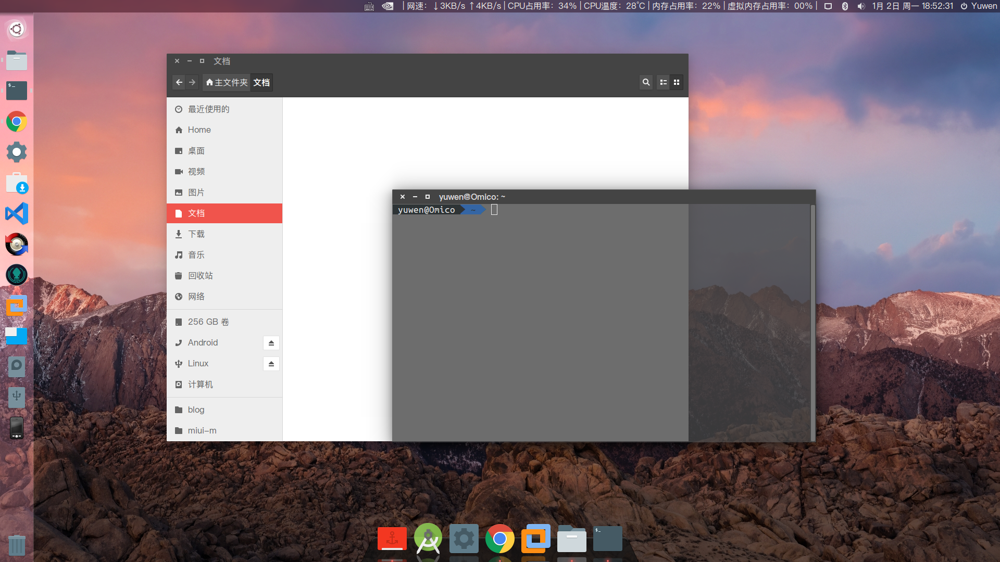

# MyThemes

### 本人在网上找的自认为好看的主题搭配的，在Ubuntu14.04到16.04都测试可用（16.10主题显示有差异），其他Linux请参考脚本自行实现，欢迎Pull Requests!

===========================
### 主题是 Numix
### 图标是 Paper
===========================

## 效果图：


## 使用方法：

#### 通过 curl

```shell
sh -c "$(curl -fsSL https://raw.githubusercontent.com/Omico/OhMyScripts/master/Scripts/MyThemes/MyThemes.sh)"
```

#### 通过 wget

```shell
sh -c "$(wget https://raw.githubusercontent.com/Omico/OhMyScripts/master/Scripts/MyThemes/MyThemes.sh -O -)"
```

